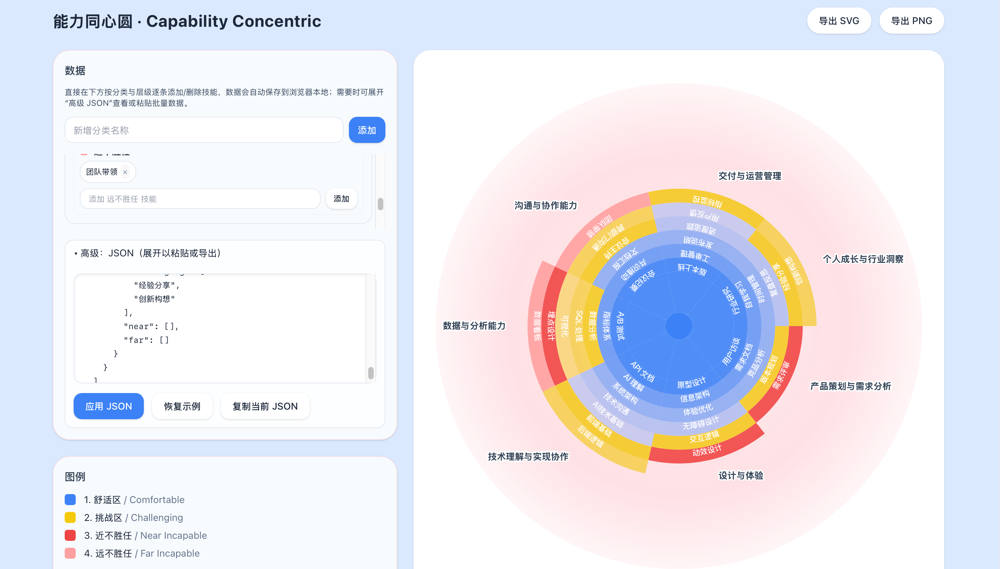

## 能力同心圆 Capability Concentric

> 一个纯 SVG 的个人能力可视化组件，支持编辑数据、环形分层、标签自适应、导出 SVG/PNG 等。

在线预览（可自行部署）：构建后直接打开 `index.html`，或 `npm run dev` 本地预览。

## 预览截图



## 功能特性
- 纯 React + SVG，无第三方图表库
- 四层能力带：舒适区 / 挑战区 / 近不胜任 / 远不胜任
- 左侧交互式编辑：分类与技能增删改、拖拽排序（同层）
- 技能标签沿弧线显示，中文/英文/emoji 智能截断
- 外圈类别标签自动避让与动态留白
- 导出 SVG/PNG（包含图例）
- 数据持久化（localStorage），支持 JSON 导入/导出

## 开发
```bash
npm i
npm run dev
```

## 构建
```bash
npm run build
npm run preview
```

## 目录结构
- `src/App.tsx` 核心组件（单文件实现）
- `public/` 静态资源
- `vite.config.ts` 开发与构建配置

## 贡献
请阅读 [CONTRIBUTING](./CONTRIBUTING.md)。

## 行为准则
遵循 [CODE_OF_CONDUCT](./CODE_OF_CONDUCT.md)。

## 安全
参见 [SECURITY](./SECURITY.md)。

## 许可协议
本项目基于 [MIT](./LICENSE) 开源。
